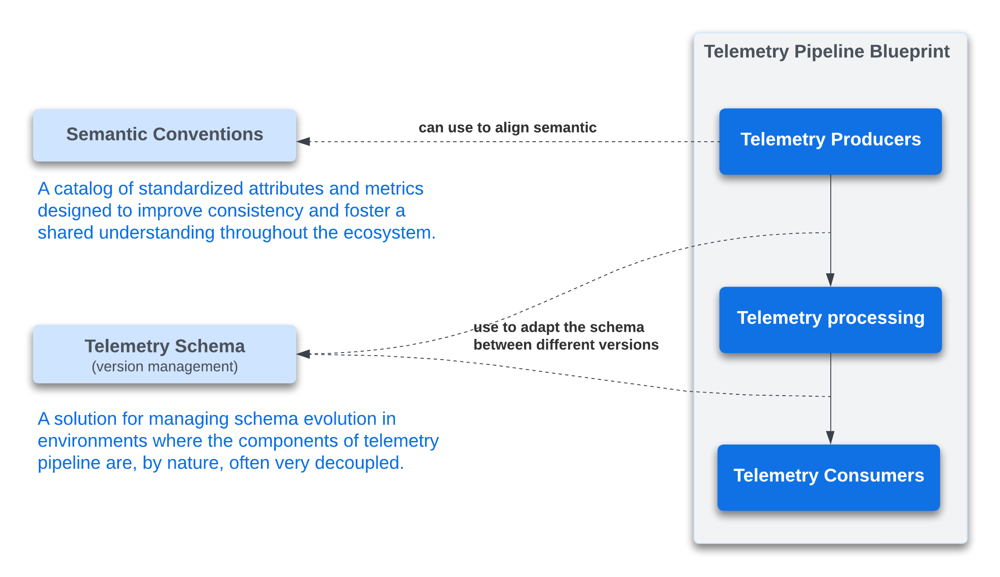
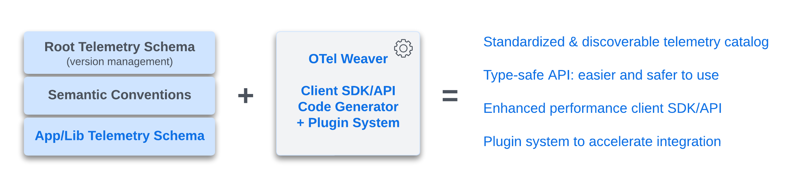
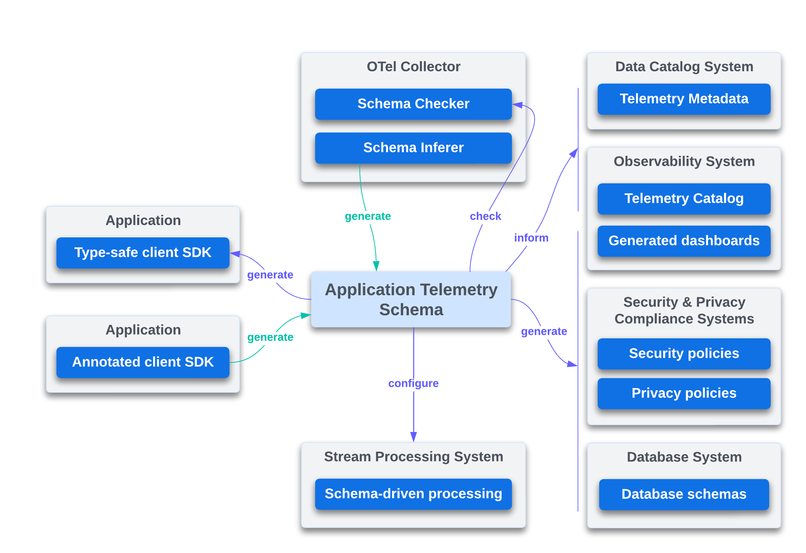

# OTel Weaver
_A Schema-Driven Client SDK Generator for OpenTelemetry_

> This project is a reference implementation of this
> [OTEP](https://github.com/lquerel/oteps/blob/main/text/0240-telemetry-schema-ext.md).
>
> This project is a work in progress and is not ready for production use.

## OpenTelemetry Schema

### Current Status

The goals of the version 1.1.0 of the Telemetry Schema and the Semantic Convention Schema are
summarized in the following diagram.



### Proposal

The proposal is to extend the Telemetry Schema with application oriented sections, 
combined with a command line tool to generate client SDK/API in various programming languages.



More specifically this project implements the OTel Weaver tool which is a schema-driven
client SDK generator for OpenTelemetry. The OTel Weaver tool is a command line tool that
can be used to generate a client SDK for a given language from a telemetry schema. This
tool is extensible via both a template engine and WASM plugins to support new languages
and new features.


## Extensibility

A template engine is used to let the community add support for new languages. The template
engine is based on [Tera](https://tera.netlify.app/docs/).

A WASM plugin system will be used to let the community add support for new features. The
following diagram shows different integration scenarios with other tools and systems.



## Usage

Resolve a schema and display the result on the standard output or write it to a file
specified with the `--output` option. This command is mainly used to validate and debug
a telemetry schema.

```bash
weaver resolve --schema telemetry-schema.yaml --output telemetry-schema-resolved.yaml
```

Generate a Rust OTel client SDK from a telemetry schema. An OTel client SDK can be used
by an application to send telemetry data to an OTel collector. The generated SDK will use
the protocol specified with the `--protocol` option. The default protocol is OTLP/gRPC.

```bash
weaver gen-client-sdk --schema telemetry-schema.yaml --language rust --protocol otel-arrow
```

Generate a Rust OTel client API from a telemetry schema. An OTel client API can be used
by a third party library to send telemetry data to an OTel collector.

```bash
weaver gen-client-api --schema telemetry-schema.yaml --language rust 
```

List all the available languages for which a client SDK/API can be generated.

```bash
weaver languages
```

Interactive terminal UI to search for attributes and metrics referenced in a given schema.

```bash
weaver search --schema <path>
```

## ToDo
**Telemetry Schema Improvements**
- [ ] Minimize number of declaration duplications in the resolved schema (especially for attributes).
- [ ] Support local/enterprise semantic convention.
- [ ] Support multiple level of telemetry schema inheritance.
- [ ] Add support for `all` in telemetry schema versions section.
- [ ] Add support for `span_events` in telemetry schema versions section.
- [ ] Add support for `apply_to_spans` in telemetry schema versions section.
- [ ] Add support for `apply_to_metrics` in telemetry schema metrics versions section.
- [ ] Add support for `split` in telemetry schema metrics versions section.
- [ ] Add support for group constraints `any_of`, ...
- [X] Add support for group extends.
- [X] Add support for group of attributes (in general and for metrics).
- [X] Support attribute value everywhere (not only in resource).

**Client SDK/API Code Generation**
- Generate Go Client SDK/API on top of the generic Go Client SDK/API.
  - Generate type-safe API for metrics.
    - [X] Synchronous and Asynchronous counters.
    - [X] Synchronous and Asynchronous up down counters.
    - [X] Asynchronous gauges.
    - [X] Synchronous histogram.
  - [ ] Generate type-safe API for metric groups.
  - [X] Generate type-safe API for events (not yet connected to the underlying OTel API).
  - [X] Generate type-safe API for spans (including nested spans).
  - [ ] Support obfuscation and masking.
- Generate Go Client SDK/API with support for OTel Arrow Protocol.
  - [ ] Generate type-safe API for metrics.
  - [ ] Generate type-safe API for metric groups.
  - [ ] Generate type-safe API for events (not yet connected to the underlying OTel API).
  - [ ] Generate type-safe API for spans.
  - [ ] Support obfuscation and masking.
- Generate Rust Client SDK/API on top of the generic Rust Client SDK/API.
  - [ ] Generate type-safe API for metrics.
  - [ ] Generate type-safe API for metric groups.
  - [ ] Generate type-safe API for events (not yet connected to the underlying OTel API).
  - [ ] Generate type-safe API for spans.
  - [ ] Support obfuscation and masking.
- Generate Rust Client SDK/API with support for OTel Arrow Protocol.
  - [ ] Generate type-safe API for metrics.
  - [ ] Generate type-safe API for metric groups.
  - [ ] Generate type-safe API for events (not yet connected to the underlying OTel API).
  - [ ] Generate type-safe API for spans.
  - [ ] Support obfuscation and masking.

**Tooling and Plugins**
  - [ ] Add support for WASM plugins.
  - [ ] Add Tera filter to apply obfuscation, masking, ... based on tags and language configuration.
  - [X] Search engine for semantic convention catalog.

## Questions
- Should we support the equivalent of trace.SpanFromContext(context.TODO()) to get the current span? 

## How to Contribute
- Add support for a new language
  - [Via Tera templates](docs/contribution.md#via-tera-templates)
  - [Via WASM plugin](docs/contribution.md#via-wasm-plugin)
- Create other WASM plugins for
  - [Schema validation](docs/contribution.md#schema-validation-plugin)
  - [Schema export](docs/contribution.md#schema-export-plugin)
  - [Variable resolver](docs/contribution.md#variable-resolver-plugin)

## Other links
- [Internal crates interdependencies](docs/dependencies.md)
- [OpenTelemetry Schema File Format v1.1.0](https://opentelemetry.io/docs/specs/otel/schemas/file_format_v1.1.0/)
- [OpenTelemetry Semantic Convention File Format](https://github.com/open-telemetry/build-tools/blob/main/semantic-conventions/syntax.md)

