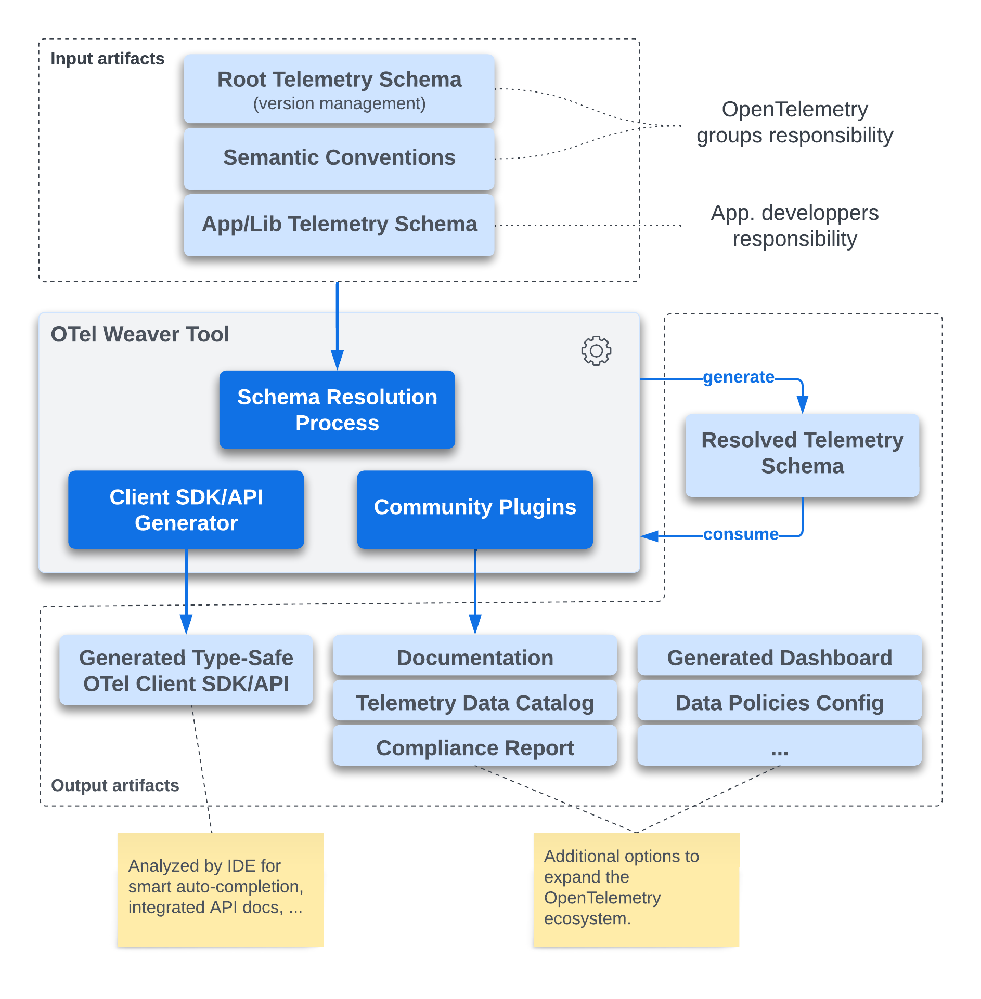

# OTel Weaver
_A Schema-Driven Client SDK Generator for OpenTelemetry_

> This project is a reference implementation of this
> [OTEP](https://github.com/lquerel/oteps/blob/main/text/0240-telemetry-schema-ext.md).
>
> This project is a work in progress and is not ready for production use.



## Usage

Resolve a schema and display the result on the standard output or write it to a file
specified with the `--output` option. This command is mainly used to validate and debug
a telemetry schema.

```bash
weaver resolve telemetry-schema.yaml --output telemetry-schema-resolved.yaml
```

Generate a Rust OTel client SDK from a telemetry schema. An OTel client SDK can be used
by an application to send telemetry data to an OTel collector. The generated SDK will use
the protocol specified with the `--protocol` option. The default protocol is OTLP/gRPC.

```bash
weaver gen-client-sdk telemetry-schema.yaml --language rust --protocol otel-arrow
```

Generate a Rust OTel client API from a telemetry schema. An OTel client API can be used
by a third party library to send telemetry data to an OTel collector.

```bash
weaver gen-client-api telemetry-schema.yaml --language rust 
```

List all the available languages for which a client SDK/API can be generated.

```bash
weaver languages
```

### Generate a Client SDK
### Check a schema
### Export a schema

## Supported Languages
- Rust
  - [ ] OTLP/gRPC
  - [ ] OTel Arrow/gRPC
- Go
  - [ ] OTLP/gRPC
  - [ ] OTel Arrow/gRPC
- C++
  - [ ] OTLP/gRPC
  - [ ] OTel Arrow/gRPC
- Python
  - [ ] OTLP/gRPC
  - [ ] OTel Arrow/gRPC
- Java
  - [ ] OTLP/gRPC
  - [ ] OTel Arrow/gRPC
- C#
  - [ ] OTLP/gRPC
  - [ ] OTel Arrow/gRPC
- JavaScript
  - [ ] OTLP/HTTP
- Swift
  - [ ] OTLP/gRPC
  - [ ] OTel Arrow/gRPC

## How to Contribute
- Add support for a new language
  - [Via Tera templates](docs/contribution.md#via-tera-templates)
  - [Via WASM plugin](docs/contribution.md#via-wasm-plugin)
- Create other WASM plugins for 
  - [Schema validation](docs/contribution.md#schema-validation-plugin)
  - [Schema export](docs/contribution.md#schema-export-plugin)
  - [Variable resolver](docs/contribution.md#variable-resolver-plugin)

## Other links
- [Internal crates interdependencies](docs/dependencies.md)
- [OpenTelemetry Schema File Format v1.1.0](https://opentelemetry.io/docs/specs/otel/schemas/file_format_v1.1.0/)
- [OpenTelemetry Semantic Convention File Format](https://github.com/open-telemetry/build-tools/blob/main/semantic-conventions/syntax.md)

## ToDo
- [ ] Support local/enterprise semantic convention.
- [ ] Support multiple level of telemetry schema inheritance.
- [ ] Report unused semantic convention import.
- [ ] Generate code from the resolved schema.
- [ ] Add Tera filter to apply obfuscation, masking, ... based on tags and language configuration.
- [X] Add support for group of attributes (in general and for metrics).
- [ ] Generate a "transferable" schema from the resolved schema removing all redundancy and unused definitions. More specifically an attribute used multiple times in the schema must be defined globally at the top level of the schema and referenced from the places where it is used.
- [ ] Add support for `all` in telemetry schema versions section.
- [ ] Add support for `span_events` in telemetry schema versions section.
- [ ] Add support for `apply_to_spans` in telemetry schema versions section.
- [ ] Add support for `apply_to_metrics` in telemetry schema metrics versions section.
- [ ] Add support for `split` in telemetry schema metrics versions section.
- [X] Add support for group extends.
- [ ] Add support for group constraints `any_of`, ...
- [ ] Search engine for semantic convention catalog.