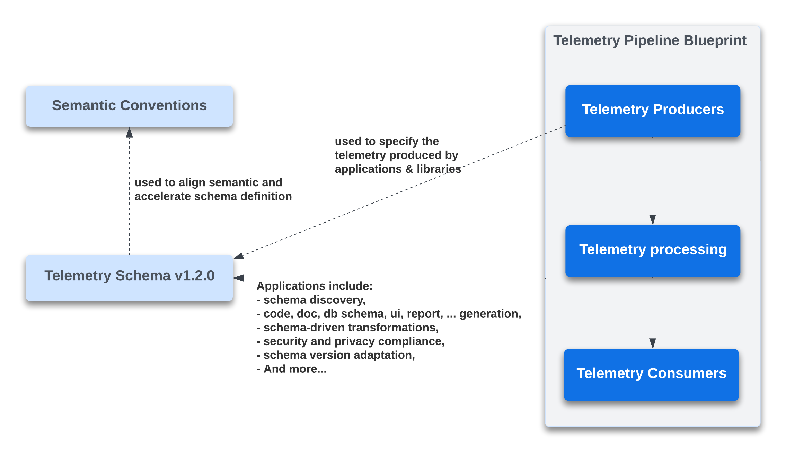
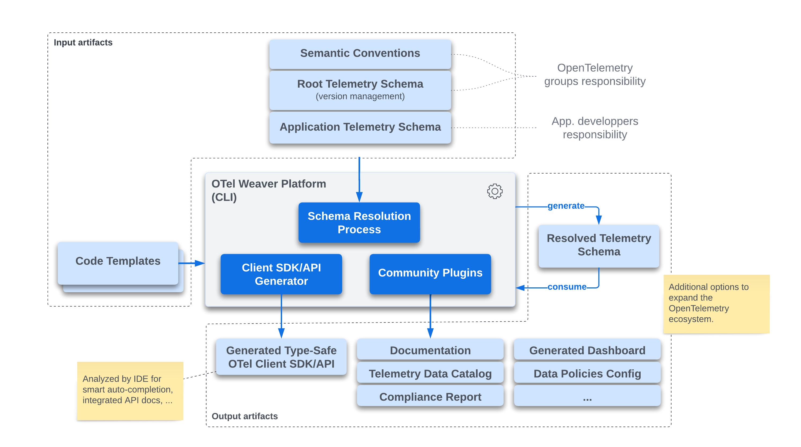

# OTel Weaver
_A Schema-Driven Client SDK Generator for OpenTelemetry_

> This project is a reference implementation of this
> [OTEP](https://github.com/lquerel/oteps/blob/main/text/0240-telemetry-schema-ext.md).
>
> This project is a work in progress and is not ready for production use.

## Overview

This project is based on the OpenTelemetry Schema format v1.2.0 defined in this
[OTEP](https://github.com/lquerel/oteps/blob/main/text/0240-telemetry-schema-ext.md) 
(which is yet to be submitted).

The following diagram illustrates the relationships between the semantic
conventions, the schema, and the various components of a telemetry pipeline.



This project was presented at the Semantic Convention SIG meeting on October 23, 2023.
The presentation slides can be accessed [here](https://docs.google.com/presentation/d/1nxt5VFlC1mUjZ8eecUYK4e4SxThpIVj1IRnIcodMsNI/edit?usp=sharing).

### Architecture

The OTel Weaver tool is architecturally designed as a platform. By default, this
tool incorporates a template engine that facilitates Client SDK/API generation
across various programming languages. In the future, we plan to integrate a
WASM plugin system, allowing the community to enhance the platform. This would
pave the way for features like enterprise data catalog integration,
documentation generation, dashboard creation, and more.

Below is a diagram detailing the primary components of the OTel Weaver tool.



## Usage

```
Usage: weaver [OPTIONS] [COMMAND]

Commands:
  resolve         Resolve a schema file and print the result
  gen-client-sdk  Generate a client SDK (application)
  languages       List of supported languages
  search          Search in a schema file
  help            Print this message or the help of the given subcommand(s)

Options:
  -d, --debug...  Turn debugging information on
  -h, --help      Print help
  -V, --version   Print version
```

### Command `resolve`

This command resolves a schema and displays the result on the standard output.
Alternatively, the result can be written to a file if specified using the
`--output` option. This command is primarily used for validating and debugging
telemetry schemas.

```bash
weaver resolve --schema telemetry-schema.yaml --output telemetry-schema-resolved.yaml
```

A "resolved schema" is one where:
- All references have been resolved and expanded.
- All overrides have been applied.

- This resolved schema is what the code generator and upcoming plugins utilize.

### Command `gen-client-sdk`

This command generates a client SDK from a telemetry schema for a given language
specified with the `--language` option.

```bash
weaver gen-client-sdk --schema telemetry-schema.yaml --language go
```

In the future, users will be able to specify the protocol to use for the generated
client SDK (i.e. OTLP or OTel Arrow Protocol) and few others options.

### Command `languages`

This command displays all the languages for which a client SDK/API can
be generated.

```bash
weaver languages
```

### Command `search`

This command provides an interactive terminal UI, allowing users to search for
attributes and metrics specified within a given schema (including dependencies).

```bash
weaver search --schema <path>
```

This search engine leverages [Tantivy](https://github.com/quickwit-oss/tantivy) 
and supports a simple [search syntax](https://docs.rs/tantivy/latest/tantivy/query/struct.QueryParser.html)
in the search bar.

## ToDo
**Telemetry Schema Improvements**
- [ ] Minimize number of declaration duplications in the resolved schema (especially for attributes).
- [ ] Support local/enterprise semantic convention.
- [ ] Support multiple level of telemetry schema inheritance.
- [ ] Add support for `all` in telemetry schema versions section.
- [ ] Add support for `span_events` in telemetry schema versions section.
- [ ] Add support for `apply_to_spans` in telemetry schema versions section.
- [ ] Add support for `apply_to_metrics` in telemetry schema metrics versions section.
- [ ] Add support for `split` in telemetry schema metrics versions section.
- [ ] Add support for group constraints `any_of`, ...
- [X] Add support for group extends.
- [X] Add support for group of attributes (in general and for metrics).
- [X] Support attribute value everywhere (not only in resource).

**Client SDK/API Code Generation**
- Generate Go Client SDK/API on top of the generic Go Client SDK/API.
  - Generate type-safe API for metrics.
    - [X] Synchronous and Asynchronous counters.
    - [X] Synchronous and Asynchronous up down counters.
    - [X] Asynchronous gauges.
    - [X] Synchronous histogram.
  - [ ] Generate type-safe API for metric groups.
  - [X] Generate type-safe API for events (not yet connected to the underlying OTel API).
  - [X] Generate type-safe API for spans (including nested spans).
  - [ ] Support obfuscation and masking.
- Generate Go Client SDK/API with support for OTel Arrow Protocol.
  - [ ] Generate type-safe API for metrics.
  - [ ] Generate type-safe API for metric groups.
  - [ ] Generate type-safe API for events (not yet connected to the underlying OTel API).
  - [ ] Generate type-safe API for spans.
  - [ ] Support obfuscation and masking.
- Generate Rust Client SDK/API on top of the generic Rust Client SDK/API.
  - [ ] Generate type-safe API for metrics.
  - [ ] Generate type-safe API for metric groups.
  - [ ] Generate type-safe API for events (not yet connected to the underlying OTel API).
  - [ ] Generate type-safe API for spans.
  - [ ] Support obfuscation and masking.
- Generate Rust Client SDK/API with support for OTel Arrow Protocol.
  - [ ] Generate type-safe API for metrics.
  - [ ] Generate type-safe API for metric groups.
  - [ ] Generate type-safe API for events (not yet connected to the underlying OTel API).
  - [ ] Generate type-safe API for spans.
  - [ ] Support obfuscation and masking.

**Tooling and Plugins**
  - [ ] Add support for WASM plugins.
  - [ ] Add Tera filter to apply obfuscation, masking, ... based on tags and language configuration.
  - [X] Search engine for semantic convention catalog.
    - [ ] Indexation of span events and links 
    - [ ] Indexation of tags

## Questions
- Should we support the equivalent of trace.SpanFromContext(context.TODO()) to get the current span? 

## How to Contribute
- Add support for a new language
  - [Via Tera templates](docs/contribution.md#via-tera-templates)
  - [Via WASM plugin](docs/contribution.md#via-wasm-plugin)
- Create other WASM plugins for
  - [Schema validation](docs/contribution.md#schema-validation-plugin)
  - [Schema export](docs/contribution.md#schema-export-plugin)
  - [Variable resolver](docs/contribution.md#variable-resolver-plugin)

## Other links
- [Internal crates interdependencies](docs/dependencies.md)
- [OpenTelemetry Schema File Format v1.1.0](https://opentelemetry.io/docs/specs/otel/schemas/file_format_v1.1.0/)
- [OpenTelemetry Semantic Convention File Format](https://github.com/open-telemetry/build-tools/blob/main/semantic-conventions/syntax.md)

