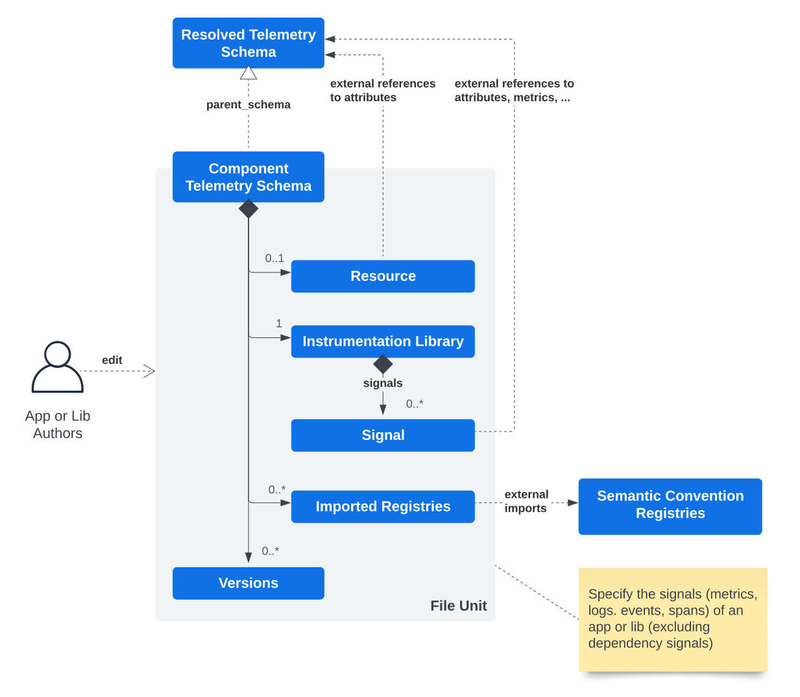

# Component Telemetry Schema

The Component Telemetry Schema is a developer-friendly format for defining an
application's or library's telemetry schema. Authors of applications or
libraries can enhance an existing Resolved Telemetry Schema by overriding or
adding new elements, importing Semantic Convention Registries, defining
resource attributes (only for applications), defining properties of the
instrumentation library, and defining the telemetry signals an application or
library can produce. They can also use the versioning mechanism from OTEP 0152.
The base schema is typically the official Telemetry Schema (Resolved), which
links to the OpenTelemetry Semantic Convention Registry. The final schema in
this system details all the signals produced by a specific application or
library.

Although there is no direct lineage between these systems, a similar approach
was designed and deployed by Facebook to address the same type of problem but in
a proprietary context (refer to
this [positional paper](https://research.facebook.com/publications/positional-paper-schema-first-application-telemetry/)
for more information).

The following diagram shows how a Component Telemetry Schema is structured.



> Note 1: Each signal definition, where possible, reuses the existing syntax and
> semantics defined by the semantic conventions. Each signal definition is also
> identified by a unique name (or ID), making schemas addressable, easy to
> traverse, validate, and diff.
>
> Note 2: This hierarchy of telemetry schemas helps large organizations in
> collaborating on the Component Telemetry Schema. It enables different
> aspects of a Component Telemetry Schema to be managed by various teams.
>
> Note 3: For all the elements that make up the Component Telemetry Schema, a
> general mechanism of annotation or tagging will be integrated in order to
> attach additional traits, characteristics, or constraints, allowing vendors
> and companies to extend the definition of concepts defined by OpenTelemetry.
>
> Note 4: Annotations and Tags can also be employed to modify schemas for
> diverse audiences. For example, the public version of a schema can exclude all
> signals or other metadata labeled as private. Similarly, elements can be
> designated as exclusively available for beta testers. These annotations can
> also identify attributes as PII (Personally Identifiable Information), and
> privacy policy enforcement can be implemented at various levels (e.g., in the
> generated client SDK or in a proxy).
>
> Note 5: This
> recent [paper](https://arxiv.org/pdf/2311.07509.pdf#:~:text=The%20results%20of%20the%20benchmark%20provide%20evidence%20that%20supports%20our,LLM%20without%20a%20Knowledge%20Graph)
> from [data.world](https://data.world/home/), along with
> the [MetricFlow framework](https://docs.getdbt.com/docs/build/about-metricflow)
> which underpins the [dbt Semantic Layer](https://www.getdbt.com/product/semantic-layer),
> highlights the significance of adopting a schema-first approach in data
> modeling, especially for Generative AI-based question answering systems. Tools
> like Observability Query Assistants (
> e.g. [Elastic AI Assistant](https://www.elastic.co/fr/blog/introducing-elastic-ai-assistant)
> and [Honeycomb Query Assistant](https://www.honeycomb.io/blog/introducing-query-assistant?utm_source=newswire&utm_medium=link&utm_campaign=query_assistant))
> are likely to become increasingly prevalent and efficient in the near future,
> thanks to the adoption of a schema-first approach.

Several OTEPs will be dedicated to the precise definition of the structure and
the format of this/these schema(s). The rules for resolving overrides
(inheritance), external references, and conflicts will also be described in
these OTEPs. See the Roadmap section for a comprehensive list of these OTEPs.

## Structure and Format

The structure and format of the component telemetry schema is given here as an
example and corresponds to the author's vision (not yet validated) of what the
structure/format of a component telemetry schema could be. The definitive
structure and format of this component schema will be discussed and finalized
later in a dedicated OTEP.

```yaml
# This file describes the structure and format of a component telemetry schema.
# A component telemetry schema can be used for three types of purposes:
# - defining the telemetry schema for an application or a service
# - defining the telemetry schema for a library
# - defining a semantic convention registry
file_format: 1.2.0
schema_url: <url-of-the-current-component-schema>
# This optional field allows to specify the parent schema of the current schema.
# The parent schema is a resolved schema.
parent_schema_url: <url-of-a-parent-resolved-schema>

# This optional section allows for importing a semantic convention registry
# from a git repository containing a set of semantic convention files. It is
# also possible to import file by file.
semantic_conventions:
  - git_url: <git-url-of-the-semantic-conventions-repository>
    path: <path-to-the-semantic-conventions-directory-inside-the-git-repo>
  - url: <url-of-the-semantic-conventions-file>

# The resource field is defined when the component schema is that of an
# application (as opposed to that of a library). The resource field contains a
# list of local references to attributes defined in the shared catalog within
# this file.
resource:
  # attributes defined locally or inherited from the parent schema (if any) or
  # from the semantic conventions (if any).
  attributes: # attribute definitions

# This optional section defines the instrumentation library, its version, and
# the schema of OTel entities reported by this instrumentation library (
# representing an application or a library component).
# This section is not defined if the current component telemetry schema is only
# used to represent a semantic convention registry.
instrumentation_library:
  name: <instrumentation-library-name>
  version: <instrumentation-library-version>
  # The schema details all the metrics, logs, and spans specifically generated
  # by that instrumentation library.
  schema:
    # Declaration of all the univariate metrics
    resource_metrics:
      - metric_name: <metric-id>
        # attributes defined locally or inherited from the parent schema (if any) or
        # from the semantic conventions (if any).
        attributes: # attribute definitions
        # ...
        # other metric fields
        # ...
        tags:
          <tag-key>: <tag-value>

    # Declaration of all the spans
    resource_spans:
      - span_name: <span-id>
        # attributes defined locally or inherited from the parent schema (if any) or
        # from the semantic conventions (if any).
        attributes: # attribute definitions
        # ...
        # other span fields
        # ...
        tags:
          <tag-key>: <tag-value>

# Reuse the same versioning mechanism already defined in the telemetry schema v1.1.0
versions: # see telemetry schema v1.1.0.
```