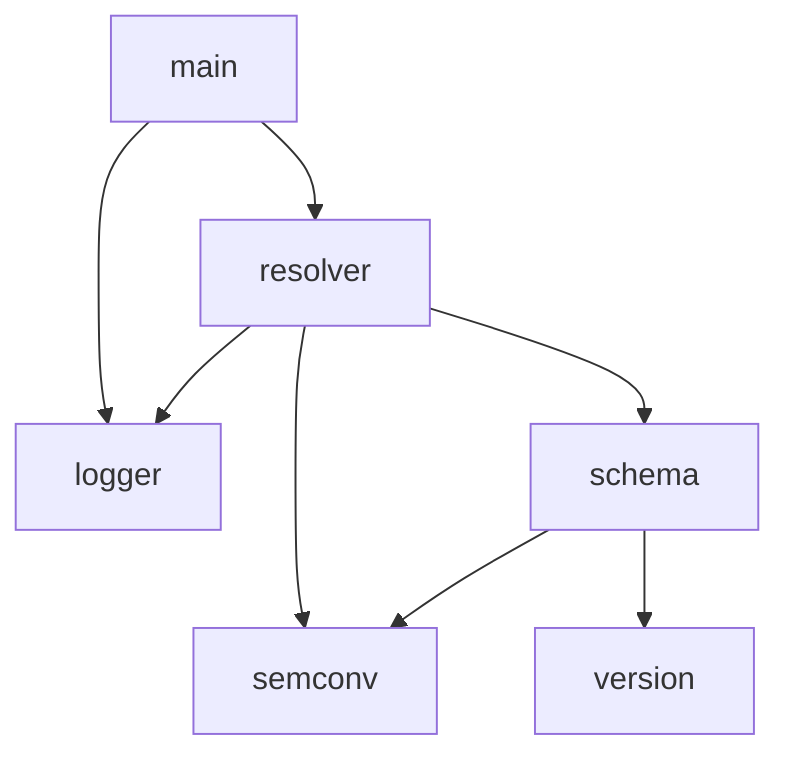

# Internal crates interdependencies

## Overview

```mermaid
flowchart TB
    resolver --> logger 
    resolver --> semconv 
    resolver --> schema     
    schema --> semconv
    schema --> version
    
    main --> logger 
    main --> resolver
    
    click resolver "../crates/resolver"
    click logger "../crates/logger"
    click semconv "../crates/semconv"
    click schema "../crates/schema"
    click version "../crates/version"
    click main "../src"
```
